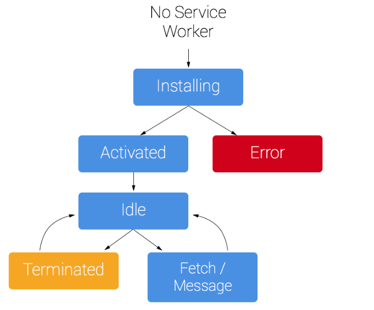

# JavaScript


## Service Worker

브라우저가 백그라운드에서 실행하는 스크립트

웹페이지와 별개로 작동, 웹페이지 또는 사용자 상호작용이 필요하지 않은 기능에 대해 문호 개방

`푸시알림 & 백그라운드동기화 ` 같은 기능에서 제공하고 있음


### 주의사항

- 자바스크립트 Worker로 DOM에 직접 액세스 할 수 없음
  - 서비스 워커는 postMessage 인터페이스를 통해 전달된 메시지에 응답하는 방식으로 제어 대상 페이지와 통신
  - 해당 페이지는 필요한 경우 DOM 조작
- 서비스 워커는 프로그래밍 가능한 네트워크 프록시, 페이지의 네트워크 요청 처리 방법을 제어

- 서비스 워크는 사용하지 않을 때 종료되고 다음에 필요할 때 다시 시작되어 
  서비스 워커의 `onfetch` 및 `onmessage` 핸들러의 전역 상태에 의존할 수 없음
  - 보관했다가 다시 시작할 때, 재사용해야 하는 정보가 있는 경우 
    서비스 워커가 IndexedDB API 대한 액세스 권한 가짐

- 서비스 워커는 프라미스를 광범위하게 사용하므로 프라미스에 대해서 미리 사전지식이 있어야


### 생명주기




### 요구사항

- 브라우저 지원
  - Chrome, Firefox, Opera
  - [지원상황](https://jakearchibald.github.io/isserviceworkerready/#moar)

- HTTPS 필요


## Tutorial

### 서비스워커 등록

load

- navigator? 
  - 전역 객체처럼 느껴지는데 맞나 ?
- 서비스워커확인 
  - [chrome://inspect/#service-workers](chrome://inspect/#service-workers)
  - [chrome://serviceworker-internals/](chrome://serviceworker-internals/)

```javascript
if ('serviceWorker' in navigator) {
  window.addEventListener('load', function() {
    navigator.serviceWorker.register('/sw.js').then(function(registration) {
      // Registration was successful
      console.log('ServiceWorker registration successful with scope: ', registration.scope);
    }, function(err) {
      // registration failed :(
      console.log('ServiceWorker registration failed: ', err);
    });
  });
}
```


### 서비스워커 설치

install

```javascript
self.addEventListener('install', function(event) {
  // Perform install steps
});
```


- install 콜백안에서 수행해야 하는 절차
  - 캐시 열기
  - 파일 캐시
  - 필요한 모든 자산이 캐시되었는지 확인
- 어느 파일 하나라도 다운로드 받지 못하면 설치 단계가 실패

```javascript
var CACHE_NAME = 'my-site-cache-v1';
var urlsToCache = [
  '/',
  '/styles/main.css',
  '/script/main.js'
];

self.addEventListener('install', function(event) {
  // Perform install steps
  event.waitUntil(
    caches.open(CACHE_NAME)
      .then(function(cache) {
        console.log('Opened cache');
        return cache.addAll(urlsToCache);
      })
  );
});
```


### 요청 캐시 및 반환

fetch

- `event.responseWith()` 내 `caches.match()`에서 프라미스를 전달
  - 이 메서드는 요청을 확인하고 서비스 워커가 생성한 캐시에서 캐시된 결과가 있는지 확인
- 일치하는 응답이 있는 경우 캐시된 값을 반환하고, 그렇지 않은 경우 fetch의 호출 결과를 반환

```javascript
self.addEventListener('fetch', function(event) {
  event.respondWith( // <- event.respondWith
    caches.match(event.request) // <- caches.match
      .then(function(response) {
        // Cache hit - return response
        if (response) {
          return response;
        }
        return fetch(event.request);
      }
    )
  );
});
```


### 서비스워커 업데이트

1. 서비스 워커 자바스크립트 파일을 업데이트
   사용자가 사이트로 이동하면 브라우저가 서비스 워커를 정의한 스크립트 파일을 백그라운드에서 다시 다운로드
   (서비스워커 파일이 현재와 1바이트라도 차이나면 새 파일로 간주)
2. 새 서비스 워커가 실행되고 **install 이벤트**가 생성
3. 이 때 이전 서비스 워커가 아직 현재 페이지를 제어하고 있어 새 서비스 워커는 **waiting 상태** 진입
4. 현재 열려 있는 사이트 페이지가 닫히면 이전 서비스 워커가 종료되고 새 서비스 워커가 제어권을 갖음
5. 새 서비스 워커가 제어권을 가지면 **activate 이벤트** 발생
   - activate 콜백에서 발새하는 한 가지 공통 작업은 캐시 관리


## 생명주기

- 오프라인 우선을 가능하게
- 현재 서비스 워커를 중단하지 않고 새로운 서비스 워커를 준비
- 범위 내 페이지가 모두 동일한 서비스 워커로 제어 ( 또는 제어하는 서비스 워커가 없음 )
- 한 번에 한 버전의 사이트만 실행
  - 서비스 워커가 없는 경우 사용자가 다른 탭에서 사이트를 새로 열 수 있어
    두 버전의 사이트가 동시에 실행될 수도


### 첫 번째 서비스 워커


#### 시나리오

- **install 이벤트**는 서비스 워커가 받는 첫 번째 이벤트이며 한번만 발생
- **installEvent.waitUtil()** 에 전달된 프라미스는 설치 기간과 설치 성공 또는 실패를 알림
- 서비스 워커는 설치가 완료된 후 활성화 될 때까지 **fetch** 및 **push** 와 같은 이벤트를 수신하지 않음
- 페이지 요청 자체가 서비스 워커를 거치지 않는 한 기본적으로 페이지 가져오기는 서비스 워커를 거치지 않음
  따라서 서비스 워커의 효과를 보려면 페이지르 새로 고쳐야
- **clients.claim()** 은 이 기본값을 재정의하고 제어되지 않는 페이지를 제어할 수 있음

```javascript
<!DOCTYPE html>
An image will appear here in 3 seconds:
<script>
  navigator.serviceWorker.register('/sw.js')
    .then(reg => console.log('SW registered!', reg))
    .catch(err => console.log('Boo!', err));

  setTimeout(() => {
    const img = new Image();
    img.src = '/dog.svg';
    document.body.appendChild(img);
  }, 3000);
</script>
```


- sw.js

```javascript
self.addEventListener('install', event => {
  console.log('V1 installing…');

  // cache a cat SVG
  event.waitUntil(
    caches.open('static-v1').then(cache => cache.add('/cat.svg'))
  );
});

self.addEventListener('activate', event => {
  console.log('V1 now ready to handle fetches!');
});

self.addEventListener('fetch', event => {
  const url = new URL(event.request.url);

  // serve the cat SVG from the cache if the request is
  // same-origin and the path is '/dog.svg'
  if (url.origin == location.origin && url.pathname == '/dog.svg') {
    event.respondWith(caches.match('/cat.svg'));
  }
});
```


#### 범위 및 제어

- 서비스 워커의 등록의 기본 범위 `./` 스크립트 URL에 상대적	
  - `//example.com/foo/bar.js`에 서비스 워커를 등록한 경우 기본범위는 `//example.com/foo/`

- 페이지, 워커 및 공유 워커를 clients 라고 부름
- 서비스 워커는 범위내에 있는 클라이언트만 제어 가능
- 클라이언트가 제어되면 가져오기는 범위 내 서비스 워커를 거침
- **navigator.serviceWorker.controller** 를 통해 클라이언트의 제어 여부를 탐지할 수 있음
  - null 또는 서비스 워커 인스턴스 중 하나로 나타남 


#### 다운로드, 파싱, 실행

- **.register()** 를 호출하면 첫 번째 서비스 워커가 다운로드
- 스크립트가 다운로드 또는 파싱하지 못하거나 초기 실행에서 오류가 발생하는 경우 
  레지스터 프라미스가 거부되고 서비스 워커 삭제


#### 설치

- 서비스 워커가 가져오는 첫 번째 이벤트는 **install** 
- 해당 이벤트는 서비스 워커가 실행되는 즉시 트리거, 서비스 워커당 한 번만 호출
- 서비스 워커 스크립트 변경시 브라우저에서 다른 서비스 워커로 간주되고 **고유한 install 이벤트**를 가져옴

- Install 이벤트는 클라이언트를 제어하기 전 필요한 모든 것을 캐시할 수 있는 기회
  - **event.waitUtil()**에 전달한 프라미스는 설치 완료 시점과 성공 여부를 브라우저에 알림
  - 프라미스가 거부되면 설치가 실패했다는 것을 알리고 브라우저가 서비스 워커를 버림
  - 이 것은 클라이언트를 제어하지 않고 **fetch** 이벤트 캐시에 있는 cat.svg에 의존할 수 없다는 뜻
  - 이는 종속성에 해당


#### 활성화

- 서비스 워커가 클라이언트를 제어하고 **push 및 sync**와 같은 함수 이벤트를 처리할 준비가 되면 **activate 발생**

- 그러나 **.register()** 를 호출한 페이지가 제어된다는 의미는 아님 (처음 등록 페이지는 제어되지 않음)

- 페이지를 새로 고침하면 페이지와 이미지가 모두 **fetch 이벤트**를 거침


#### clients.claim

- 서비스 워커가 활성화되면 서비스 워커 내에서 **clients.claim()** 을 호출하여 제어되지 않은 클라이언트를 제어

- 네트워크를 통한 로드와 다른 방식으로 페이지를 로드하도록 서비스 워커를 사용하는 경우,
  서비스 워커 없이 로드한 일부 클라이언트를 서비스 워커가 제어하여 **clients.claim()** 이 번거로울 수 있음

```javascript
self.addEventListener('activate', event => {
  clients.claim();
  console.log('Now ready to handle fetches!');
});
```


> 참고: 많은 사람들이 `clients.claim()`을 상용구로 포함하지만 저는 좀처럼 그렇게 하지 않습니다. 이는 첫 번째 로드에서만 문제가 되며, 점진적 개선 덕분에 페이지는 일반적으로 서비스 워커 없이도 정상적으로 작동합니다.


### 서비스워커 업데이트

- 업데이트 트리거

  - 범위 내 페이지 탐색 시
  - 이전 24시간 내에 업데이트 확인이 없는 한, **push 및 sync** 와 같은 함수 이벤트 시
  - **.register()** 호출 시 ( 서비스 워커 URL이 변경된 경우에만)

  

#### 시나리오

- 대부분 브라우저는 등록된 서비스 워커 스크립트의 업데이트를 확인할 때 캐싱 헤더를 무시하는 것이 기본
  - **importScripts()** 를 통해 서비스 워커 내에서 로드되는 리소스를 가져올 때는 여전히 캐싱 헤더를 고려
  - 이 기본 동작은 서비스 워커를 등록할 때 **updateViaCache** 옵션을 설정하여 재정의

- 서비스 워커는 브라우저에 이미 있는 것과 하나만 달라도 업데이트 된 것으로 간주
- 업데이트 된 서비스 워커는 기존 서비스 워커와 함께 시작되면 고유한 **install 이벤트**를 가져옴

- 새 워커가 설치 중에 거부되면 새 워커는 버려지고 현재 워커는 활성 상태를 유지
  - (비정상 상태 코드이거나,  파싱에 실패하거나, 실행중 오류가 발생하거나)

- 성공적으로 설치되면 업데이트된 워커는 기존 워커가 제로 클라이언트를 제어할 때 까지 **wait** 를 수행
  - (새로 고치는 동안 클라이언트 중첩)
- **Self.skipWaiting()** 은 대기를 방지, 즉 설치를 마치자 마자 서비스 워커 활성화


```javascript
const expectedCaches = ['static-v2'];

self.addEventListener('install', event => {
  console.log('V2 installing…');

  // cache a horse SVG into a new cache, static-v2
  event.waitUntil(
    caches.open('static-v2').then(cache => cache.add('/horse.svg'))
  );
});

self.addEventListener('activate', event => {
  // delete any caches that aren't in expectedCaches
  // which will get rid of static-v1
  event.waitUntil(
    caches.keys().then(keys => Promise.all(
      keys.map(key => {
        if (!expectedCaches.includes(key)) {
          return caches.delete(key);
        }
      })
    )).then(() => {
      console.log('V2 now ready to handle fetches!');
    })
  );
});

self.addEventListener('fetch', event => {
  const url = new URL(event.request.url);

  // serve the horse SVG from the cache if the request is
  // same-origin and the path is '/dog.svg'
  if (url.origin == location.origin && url.pathname == '/dog.svg') {
    event.respondWith(caches.match('/horse.svg'));
  }
});
```


#### 설치


#### 대기

설치 후 업데이트된 서비스워커는 기존 서비스워커가 더 이상 클라이언트를 제어하지 않을 때까지 활성화를 지연

이 상태를 대기라고 하며, 브라우저가 한 번에 한 버전의 서비스 워커만 실행하도록 보장


#### 활성화

이전 서비스 워커가 사라지고 새 서비스 워커가 클라이언트를 제어할 수 이는 경우 작업이 시작

이 때가 이전 워커가 아직 사용중인 동안 할 수 업던 작업(DB 마이크레이션 캐시 지우기)을 수행하기에 이상적인 시간 


#### 대기 단계 건너뛰기

대기 단계는 한 번에 하나의 사이트 버전만 실행하고 있음을 의미하지만, 

해당 기능이 필요치 않은 경우 **self.skipWaiting()** 을 호출하여 새 서비스 워커를 더 빨리 활성화

서비스 워커가 현재 진행중인 워커를 퇴장시키고 대기 단계에 진입하자마자 활성화

```javascript
self.addEventListener('install', event => {
  self.skipWaiting();

  event.waitUntil(
    // caching etc
  );
});
```

