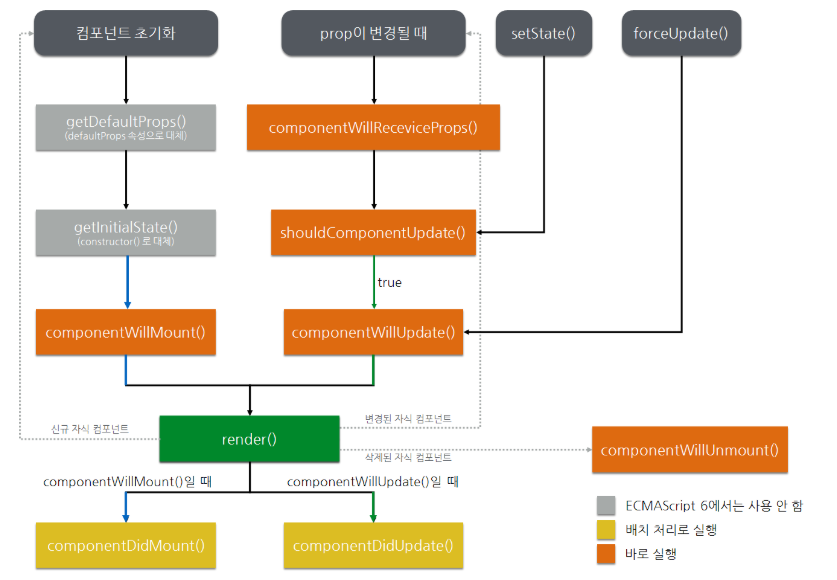

#  React 

- React vs Vue
  - [https://joshua1988.github.io/web_dev/vue-or-react](https://joshua1988.github.io/web_dev/vue-or-react)


Docs


- 자습서
  - https://ko.reactjs.org/tutorial/tutorial.html

- 개념서
  - https://ko.reactjs.org/docs/hello-world.html


## JSX


### React Element

React Element `JSON 객체`를 사용하여 DOM 구조를 표현하는 방식

JSX를 빌드하면 React Element로 변환


### React Component

props를 전달받아 React Element를 반환하는 function or class


### JSX

별도의 파일에 마크업(HTML)과 로직(JavaScript)를 넣어 기술을 인위적으로 분리

둘 다 포함하는 `컴포넌트` 라고 부르는 느슨하게 연결된 유닛으로 관심사를 분리

필수요소는 아니지만 로직(JavaScript) 안에서 UI관련 작업을 할 떄 시각적으로 더 도움이 된다고 생각

- (Tip. class -> className)

- (Tip. 실제 DOM은 아니며 React Element로 반환)


```react
const name = 'Heo';
const element = <h1>Hello, {name}</h1>;

ReactDOM.render(
	element,
  docuemnt.getElementById('root');
);
```


#### JSX 객체 & 로직

JSX도 하나의 표현식

컴파일이 끝나면 JSX 표현식이 정규 JavaScript 함수 호출이 되고 JavaScript 객체로 인식

따라서 if, for와 같은 로직을 사용할 수 있음


객체기 때문에 다음과 같은 속성을 가질 수 있음

```react
const element = </img>;
```


아래 두개의 객체는 동일 ( React.createELement() 함수 사용 )

```react
const element = (
	<h1 className="greeting">
  	hello, world!
  </h1>
);

# React Element
const elementB = React.createElement(
	'h1',
  { className : 'greating' },
	'hello, world!'
);
```


#### JSX 태그 규칙

- 기본 html 태그는 소문자로 시작 (React.DOM)
- 사용자 정의 Component는 대문자로
- HTML과 달리 모든 태그는 self-closing 가능


## ReactROM & ReactDOMServer

React Element는 불변객체로 Element를 생성한 이후에는 해당 Element의 자식이나 속성을 변경할 수 없음

Element는 영화에서 하나의 프레임과 같이 특정 시점의 UI 제공

```
ReactDOM.render() 함수는 한 번만 호출하며, 실제 Element 객체가 변하는 것이 아닌 노드의 텍스트 영역만 변동
```


### ReactDOM

- render()

```react
ReactDOM.render(
  reactElement,
  containerDOM,
  [callback]
)
```

- unmountComponentAtNode()
- findDomNode() 
  - Ref 대체 가능, funcctional component 불가


### ReactDOMServer

- renderToString()
  - server rendering 후 client rendering 시 재사용
- renderToStaticMarkup()
  - 단순 static 마크업 생성


## Components & Props

### components

위와 동일

컴포넌트를 쪼개는 것을 꺼리지 말고 재사용이 높다면 컴포넌트를 적극적으로 쪼개세요

React 컴포넌트는 자신의 props를 다룰 때 반드시 순수함수(외부 영향이 없는 단순 함수)처럼 동작해야 합니다.


### props

React가 사용자 정의 컴포넌트로 작성한 엘리먼트를 발견하면 

JSX 어트리부트를 해당 컴포넌트에 단일 객체로 전달하며 이 객체를 props라고 정의


> typeA. ES5 function
>
> 컴포넌트로 사용할 함수는 대문자를 쓰나요 ? -> 네

```react
function Welcome(props) {
  return <h1>Hello, {props.name}!</h1>
}
```


> typeB. ES6 class

```react
class Welcome extends React.Component {
  render() {
    return <h1>Hello, {this.props.name}</h1>;
  }
}
```


> Component render

```react
const element = <Welcome name="Heo" />;
```


#### defaultProps

상위에서 props를 정의하지 않았을 때

```react
class Counter extends React.Component {
	render() {
    // const { count = 2 } = this.props;
    return <div>count: {this.props.coount}</div>
	}
}

// 권장
Counter.defaultProps = {
  count : 1
}
```


## State & LifeCycle

### state

state는 props와 유사하지만 비공개이며 컴포넌트에 의해 완전히 제어


`props(properties) vs state`

props는 컴포넌트에 전달되는 반면, state는 (함수내 선언된 변수처럼) 컴포넌트 안에서 관리


```react
class Clock extends React.Component {
  constructor(props) {
    super(props);
    this.state = {date: new Date()};
  }
  
  render() {
    return (
    	<div>
      	<h1>Hello, World!</h1>
        <h2>It is {this.state.date.toLocaleTimeString()}.</h2>
      </div>
    );
  }
}
```


#### setState()

- 비동기로 동작

```react
this.setState({count:1});
```


- 비동기 동작이기 때문에 주의할 점

+1 

```react
this.setState({count:1});
this.setState({count:1});
```

+2

```react
this.setState((prevState) => ({count:prevState.count+1}))
this.setState((prevState) => ({count:prevState.count+1}))
```


> 직접 state를 수정하지 마세요. setState() 메서드를 사용하세요.
> 렌더링 하지 못합니다.


### lifeCycle




- example

1. ReactDOM.render() 전달시 Clock 컴포넌트의 `constructor` 호출
2. Clock 컴포넌트의 `render()` 호출
3. `componentDidMount()` 생명주기 메서드 호출, tick() 호출
4. Clock 컴포넌트는 `setState()`에 현재 시각을 포함하는 객체를 호출하며 UI 업데이트 진행
5. 출 덕분에 state 변경을 인지하고 화면에 표시될 내용을 알아내기 위해 `render()` 다시 호출
6. Clock 컴포넌트가 DOM으로 부터 한 번이라도 삭제된 적이 있다면 `componentWillUnmount()` 생명주기 메서드 호출

```react
class Clock extends React.Component {
  constructor(props) {
    super(props);
    this.state = {date: new Date()};
  }
  
  componentDidMount() {
    this.timerID = setInterval(
    	() => this.tick(),
      1000
    );
  }
  
  componentWillUnmount() {
    clearInterval(this.timerID);
  }
  
  tick() {
    this.setState({
      date: new Date()
    });
  }
  
  render() {
    return (
    	<div>
      	<h1>Hello, World!</h1>
        <h2>It is {this.state.date.toLocaleTimeString()}.</h2>
      </div>
    );
  }
}
```


#### Mounting

- constructor(props)
- componentWillMount()
  -  ES6에선 constructor 대체 (=constructor)
- render()
  - DOM 구성
- componentDidMount()


#### Updating


> 언제실행? props가 업데이트 될 경우

- componentWillReceiveProps(nextProps)
- shouldComponentUpdate(nextProps, nextState) 
  - return true - 뒤로진행
  - return false - 진행중단
- componentWillUpdate(nextProps, nextState)
- render()
- componentDidUpdate(prevProps, prevState)


#### Unmounting

- componentWillUnmount()


## Event

- 실제 DOM element의 event handling과 비슷
- event callback 함수에 전달되는 event 객체는 React에서 합성한 event 객체
- 실제 event 객체에 접근하기 위해서는 `e.nativveEvent` 사용
- 이름 규칙으로 camelCase 사용
- JSX를 사용하여 `문자열이 아닌 함수`로 이벤트 핸들러 전달
- 기본 동작 방지를 위해 `preventDefault` 명시적으로 호출 (return false; X)


> HTML vs React

- addEventListener() 사용할 필요 없음

```react
<!-- HTML -->
<button onClick="activateLasers()">
  Activate Lasers
</button>

<!-- React -->
<button onClick={activateLasers}>
  Activate Lasers
</button>
```


> preventDefault

```react
function ActionLink() {
  function handleClick(e) {
    e.preventDefault();
    console.log('The link was clicked.');
  }

  return (
    <a href="#" onClick={handleClick}>
      Click me
    </a>
  );
}
```


> binding (typeA)

```react
class Toggle extends React.Component {
  constructor(props) {
    super(props);
    this.state = {isToggleOn: true};

    // 콜백에서 `this`가 작동하려면 아래와 같이 바인딩 해주어야 합니다.
    this.handleClick = this.handleClick.bind(this);
  }

  handleClick() {
    this.setState(state => ({
      isToggleOn: !state.isToggleOn
    }));
  }

  render() {
    return (
      <!-- bind 없이 onClick 전달했다면 this는 undefined 처리 -->
      <button onClick={this.handleClick}>
        {this.state.isToggleOn ? 'ON' : 'OFF'}
      </button>
    );
  }
}

ReactDOM.render(
  <Toggle />,
  document.getElementById('root')
);
```


> bind (typeB)

LoggingButton가 렌더링 될 때마다 다른 콜백이 생성

콜백이 하위 컴포넌트에 props로 전달 된다면 그 컴포넌트들은 추가로 다시 렌더링을 수행할 수도 있음

따라서 typeA 방식을 권장

```react
class LoggingButton extends React.Component {
  handleClick() {
    console.log('this is:', this);
  }

  render() {
    // 이 문법은 `this`가 handleClick 내에서 바인딩되도록 합니다.
    return (
      <button onClick={(e) => this.handleClick(e)}>
        Click me
      </button>
    );
  }
}
```


> parameter

```react
<!-- Lambda --> 
<button onClick={(e) => this.deleteRow(id, e)}>Delete Row</button>

<!-- prototype bind -->
<button onClick={this.deleteRow.bind(this, id)}>Delete Row</button>
```


>  function을 prop으로 전달하는 경우, re-render를 피하기 위해 `JSX inline function` 바로 사용은 좋지 않음

```react
<!-- RIGHT -->
<Child handleClick={this.handleClick} />

<!-- WRONG --> 
<Child handleClick={() => console.log("click!")} />
```


## Ref

React에서의 DOM 제어

Ref는 render 메서드에서 생성된 `DOM Element`나 `React Conponent`에 접근하는 방법을 제공


- `사용하는 경우` (이 외의 경우에는 되도록 사용하지 않는 것이 좋다.)
  - 포커스, 텍스트 선택영역, 혹은 미디어의 재생을 관리
  - 애니메이션을 직접적으로 실행
  - 서드 파티 DOM 라이브러리를 React와 같이 사용


> `남용하지마세요!` ref는 애플리케이션에 어떤 일이 일어나게 할 때 사용될 수 있습니다. 
>
> 그럴 때 잠시 멈추고 어느 컴포넌트 계층에서 상태를 소유해야 할 지 신중히 고려하세요.
>
> ( 대부분 상위 계층이며, state 끌어올리기로 처리가 가능합니다.)


### React.createRef()

**Ref 생성하기** 

ref 어트리뷰트를 통해 React 엘리먼트에 부착

보통 컴포넌트의 인스턴스가 생성될 때 Ref 프로퍼티로서 추가하고, 

컴포넌트의 인스턴스의 어느 곳에서도 Ref에 접근할 수 있게 처리

```react
class MyComponent extends React.Component {
  constructor(props) {
    super(props);
    this.myRef = React.createRef();
  }
  render() {
    return <div ref={this.myRef} />;
  }
}
```


### current

**Ref 접근하기 & 사용하기**

render 메서드 안에서 ref가 엘리먼트에게 전달 되면 그 노드를 향한 참조는 ref의 current 어트리뷰트에 담긴다.

```react
const node = this.myref.current;
```


#### current 유형

1. ref 어트리뷰트가 HTML 엘리먼트에 쓰였다면 생성자에서 React.createRef()로 생성된 ref는 
   자신이 전달받은 DOM 엘리먼트를 current 프로퍼티의 값으로 받음

2. ref 어트리뷰트가 커스텀 클래스 컴포넌트에 쓰였다면, 
   ref 객체는 마운트된 컴포넌트의 인스턴스를 current  프로퍼티 값으로 받음

3. 함수 컴포넌트는 인스턴스가 없어 ref 어트리뷰트 사용 불가


#### exampleA : DOM element

`ref`를 수정하는 작업은 `componentDidMount` 또는 `componentDidUpdate` 생명주기 메서드가 

호출되기 전에 이루어집니다.

```react
class CustomTextInput extends React.Component {
  constructor(props) {
    super(props);
    // textInput DOM 엘리먼트를 저장하기 위한 ref를 생성합니다.
    this.textInput = React.createRef();
    this.focusTextInput = this.focusTextInput.bind(this);
  }

  focusTextInput() {
    // DOM API를 사용하여 명시적으로 text 타입의 input 엘리먼트를 포커스합니다.
    // 주의: 우리는 지금 DOM 노드를 얻기 위해 "current" 프로퍼티에 접근하고 있습니다.
    this.textInput.current.focus();
  }

  render() {
    // React에게 우리가 text 타입의 input 엘리먼트를
    // 우리가 생성자에서 생성한 `textInput` ref와 연결하고 싶다고 이야기합니다.
    return (
      <div>
        <input
          type="text"
          ref={this.textInput} />

        <input
          type="button"
          value="Focus the text input"
          onClick={this.focusTextInput}
        />
      </div>
    );
  }
}
```


#### exampleB : Class Component

컴포넌트의 인스턴스가 마운트 된 이후 즉시 클릭되는 걸 흉내내기 위해 `CustomTextInput` 컴포넌트를 감싸는 걸 원한다면, 

ref를 사용하여 `CustomTextInput` 컴포넌트의 인스턴스에 접근하고 직접 `focusTextInput` 메서드를 호출

단 클래스가 컴포넌트일 경우에만 동작합니다. (함수 컴포넌트일 경우 동작하지 않음)

```react
class AutoFocusTextInput extends React.Component {
  constructor(props) {
    super(props);
    this.textInput = React.createRef();
  }

  componentDidMount() {
    this.textInput.current.focusTextInput();
  }

  render() {
    return (
      <CustomTextInput ref={this.textInput} />
    );
  }
}
```


### 부모컴포넌트에게 DOM ref 공개

- 언제 어디서 쓰니 ?


### Callback ref

ref 어트리뷰트에 React.createRef()를 통해 생성된 ref를 전달하는 대신 함수를 전달

전달된 함수는 다른 곳에 저장되고 접근될 수 있는 React 컴포넌트의 인스턴스나 DOM 엘리먼트를 인자로서 받음


```react
class CustomTextInput extends React.Component {
  constructor(props) {
    super(props);

    this.textInput = null;

    this.setTextInputRef = element => {
      this.textInput = element;
    };

    this.focusTextInput = () => {
      // DOM API를 사용하여 text 타입의 input 엘리먼트를 포커스합니다.
      if (this.textInput) this.textInput.focus();
    };
  }

  componentDidMount() {
    // 마운트 되었을 때 자동으로 text 타입의 input 엘리먼트를 포커스합니다.
    this.focusTextInput();
  }

  render() {
    // text 타입의 input 엘리먼트의 참조를 인스턴스의 프로퍼티
    // (예를 들어`this.textInput`)에 저장하기 위해 `ref` 콜백을 사용합니다.
    return (
      <div>
        <input
          type="text"
          ref={this.setTextInputRef}
        />
        <input
          type="button"
          value="Focus the text input"
          onClick={this.focusTextInput}
        />
      </div>
    );
  }
}
```


- Parent 자신의 콜백 ref를 inputRef prop으로서 CustomTextInput에게 전달

```react
function CustomTextInput(props) {
  return (
    <div>
      <input ref={props.inputRef} />
    </div>
  );
}

class Parent extends React.Component {
  render() {
    return (
      <CustomTextInput
        inputRef={el => this.inputElement = el}
      />
    );
  }
}
```


## Conditional Rendering


> 논리연산자 & 엘리먼트

```react
function Mailbox(props) {
  const unreadMessages = props.unreadMessages;
  return (
    <div>
      <h1>Hello!</h1>
      {unreadMessages.length > 0 &&
        <h2>
          You have {unreadMessages.length} unread messages.
        </h2>
      }
    </div>
  );
}

const messages = ['React', 'Re: React', 'Re:Re: React'];
ReactDOM.render(
  <Mailbox unreadMessages={messages} />,
  document.getElementById('root')
);
```


> IF-ELSE (typeA)

```react
render() {
  const isLoggedIn = this.state.isLoggedIn;
  return (
    <div>
      The user is <b>{isLoggedIn ? 'currently' : 'not'}</b> logged in.
    </div>
  );
}
```


> IF-ELSE (typeB)

```react
render() {
  const isLoggedIn = this.state.isLoggedIn;
  return (
    <div>
      {isLoggedIn ? (
        <LogoutButton onClick={this.handleLogoutClick} />
      ) : (
        <LoginButton onClick={this.handleLoginClick} />
      )}
    </div>
  );
}
```


## List & Key


> 엘리먼트 배열

```react
const numbers = [1, 2, 3, 4, 5];
const listItems = numbers.map((number) =>
  <li>{number}</li>
);
```


> 엘리먼트 key

- key는 React가 어떤 항목을 변경, 추가 또는 삭제할지 식별할 때 사용

- key를 선택하는 가장 좋은 방법은 리스트를 다른 항목들 사이에서 해당 항목을 고유하게 식별할 수 있는 문자열 사용 
  (데이터 ID)
  (데이터 ID가 없다면 최후의 수단으로 INDEX를 사용합니다, 하지만 항목 순서가 바뀔 수 있는 경우 권장 X)
- key 주변 배열 context에서만 의미가 있습니다.
- key는 형제 사이에서만 고유한 값이여야 합니다.
- 컴포넌트에서 key를 사용하진 않습니다. 만약 key와 같은 value가 필요하다면 prop에 재정의합니다.


다음 코드에서 <li> 태크에 key가 없다면 key를 넣어야 한다는 경고를 발생

key는 엘리먼트 리스트르 만들 때 포함해야 하는 특수한 문자열 어트리뷰트

```react
function NumberList(props) {
  const numbers = props.numbers;
  const listItems = numbers.map((number) =>
    <li key={number.toString()}>
      {number}
    </li>
  );
  return (
    <ul>{listItems}</ul>
  );
}

const numbers = [1, 2, 3, 4, 5];
ReactDOM.render(
  <NumberList numbers={numbers} />,
  document.getElementById('root')
);
```


> Key로 컴포넌트 추출

키 주변 배열 context에서만 의미가 있습니다.

```react
function ListItem(props) {
  const value = props.value;
  return (
    // 틀렸습니다! 여기에는 key를 지정할 필요가 없습니다.
    <li key={value.toString()}>
      {value}
    </li>
  );
}

function NumberList(props) {
  const numbers = props.numbers;
  const listItems = numbers.map((number) =>
    // 틀렸습니다! 여기에 key를 지정해야 합니다.
    <ListItem value={number} />
  );
  return (
    <ul>
      {listItems}
    </ul>
  );
}

const numbers = [1, 2, 3, 4, 5];
ReactDOM.render(
  <NumberList numbers={numbers} />,
  document.getElementById('root')
);
```


## Form

https://ko.reactjs.org/docs/forms.html


> 제어컴포넌트(controlled components)

```react

```


## State 끌어올리기

동일한 데이터의 변경사항을 여러 컴포넌트에 반영


> State 끌어올리기 예제

예제가 너무 어려운데 ..


즉, 하위에 같은 state(진리의원천) 를 사용해야 하면 state 값을 부모로 올려서 받아 사용하는 개념

하지만 자식 컴포넌트는 부모 컴포넌트의 state를 받을 수 없기 때문에 이벤트에 따라 부모의 state를 함수를 통해 호출

(자식 컴포넌트가 state를 호출할 수 있도록 prop에 호출 함수를 미리 가지고 있음)

```react
class TemperatureInput extends React.Component {
  constructor(props) {
    super(props);
    this.handleChange = this.handleChange.bind(this);
  }

  handleChange(e) {
    this.props.onTemperatureChange(e.target.value);
  }

  render() {
    const temperature = this.props.temperature;
    const scale = this.props.scale;
    return (
      <fieldset>
        <legend>Enter temperature in {scaleNames[scale]}:</legend>
        <input value={temperature}
               onChange={this.handleChange} />
      </fieldset>
    );
  }
}

class Calculator extends React.Component {
  constructor(props) {
    super(props);
    this.handleCelsiusChange = this.handleCelsiusChange.bind(this);
    this.handleFahrenheitChange = this.handleFahrenheitChange.bind(this);
    this.state = {temperature: '', scale: 'c'};
  }

  handleCelsiusChange(temperature) {
    this.setState({scale: 'c', temperature});
  }

  handleFahrenheitChange(temperature) {
    this.setState({scale: 'f', temperature});
  }

  render() {
    const scale = this.state.scale;
    const temperature = this.state.temperature;
    const celsius = scale === 'f' ? tryConvert(temperature, toCelsius) : temperature;
    const fahrenheit = scale === 'c' ? tryConvert(temperature, toFahrenheit) : temperature;

    return (
      <div>
        <TemperatureInput
          scale="c"
          temperature={celsius}
          onTemperatureChange={this.handleCelsiusChange} />

        <TemperatureInput
          scale="f"
          temperature={fahrenheit}
          onTemperatureChange={this.handleFahrenheitChange} />

        <BoilingVerdict
          celsius={parseFloat(celsius)} />

      </div>
    );
  }
}
```


## 합성 (vs 상속)

- React는 강력한 합성 모델을 가지고 있으며, 상속 대신 합성을 사용하여 컴포넌트 간에 코드를 재사용하는 것이 좋습니다.
- props.children (의미를 가진 변수)


> 자식을 중첩하여 전달하기

props로 JSX를 전달하며, 자식이 한 개일 경우에는 태크 사이에 입력하는 것(props.children)으로 전달이 가능

```react
function FancyBorder(props) {
  return (
    <div className={'FancyBorder FancyBorder-' + props.color}>
      {props.children}
    </div>
  );
}

function WelcomeDialog() {
  return (
    <FancyBorder color="blue">
      <!-- children Start -->
      <h1 className="Dialog-title">
        Welcome
      </h1>
      <p className="Dialog-message">
        Thank you for visiting our spacecraft!
      </p>
      <!-- children End -->
    </FancyBorder>
  );
}
```


> 자식을 2개 이상 전달하기

props로 JSX를 전달

```react
function SplitPane(props) {
  return (
    <div className="SplitPane">
      <div className="SplitPane-left">
        {props.left}
      </div>
      <div className="SplitPane-right">
        {props.right}
      </div>
    </div>
  );
}

function App() {
  return (
    <SplitPane left={<Contacts />} right={<Chat />} />
  );
}
```


> 특수화 (state를 전달하는 합성)

```react
function Dialog(props) {
  return (
    <FancyBorder color="blue">
      <h1 className="Dialog-title">
        {props.title}
      </h1>
      <p className="Dialog-message">
        {props.message}
      </p>
      {props.children}
    </FancyBorder>
  );
}

class SignUpDialog extends React.Component {
  constructor(props) {
    super(props);
    this.handleChange = this.handleChange.bind(this);
    this.handleSignUp = this.handleSignUp.bind(this);
    this.state = {login: ''};
  }

  render() {
    return (
      <Dialog title="Mars Exploration Program"
              message="How should we refer to you?">
        
        <!-- children - state 전달가능 -->
        <input value={this.state.login}
               onChange={this.handleChange} />
        <button onClick={this.handleSignUp}>
          Sign Me Up!
        </button>
        <!-- children - state 전달가능 -->
        
      </Dialog>
    );
  }

  handleChange(e) {
    this.setState({login: e.target.value});
  }

  handleSignUp() {
    alert(`Welcome aboard, ${this.state.login}!`);
  }
}
```


## Context

하위 모든 React Component에 data를 바로 전달할 수 있는 강력 API

(React에서는 사용하지 않는 것을 권장하고 있음)


- Context를 이용하면 단계마다 일일이 props를 넘겨주지 않고도 컴포넌트 트리 전체에 데이터를 제공
- Context를 사용하면 컴포넌트 재사용이 어려움, Context보다 컴포넌트 합성이 더 간단한 경우가 있음
  - 체이닝되어 내려가는 것이 아니라, 사용할 곳에 합성으로 컴포넌트를 children으로 전달하는 방식


> Context 활용

```react
const ThemeContext = React.createContext('light');

class App extends React.Component {
  render() {
    // Provider를 이용해 하위 트리에 테마 값을 보내줍니다.
    // 아무리 깊숙히 있어도, 모든 컴포넌트가 이 값을 읽을 수 있습니다.
    // 아래 예시에서는 dark를 현재 선택된 테마 값으로 보내고 있습니다.
    return (
      <ThemeContext.Provider value="dark">
        <Toolbar />
      </ThemeContext.Provider>
    );
  }
}

function Toolbar(props) {
  return (
    <div>
      <ThemedButton />
    </div>
  );
}

class ThemedButton extends React.Component {
  // 현재 선택된 테마 값을 읽기 위해 contextType을 지정합니다.
  // React는 가장 가까이 있는 테마 Provider를 찾아 그 값을 사용할 것입니다.
  // 이 예시에서 현재 선택된 테마는 dark입니다.
  static contextType = ThemeContext;
  render() {
    return <Button theme={this.context} />;
  }
}
```


### React.creactContext

트리 상위에서 가장 가까이 있는 짝이 맞는 Provider로부터 현재값을 읽음

`defaultValue`  매개변수는 트리안에서 적절한 Provider를 찾지 못했을 때만 사용


> 하위 컴포넌트에서 context 참조할 때

```react
const MyContext = React.createContext(defaultValue);
```


> 하위 컴포넌트에서 context 수정할 때

```react
// createContext에 보내는 기본값의 모양을
// 하위 컴포넌트가 받고 있는 매개변수 모양과 동일하게 만드는 것 잊지마세요!
export const ThemeContext = React.createContext({
  theme: themes.dark,
  toggleTheme: () => {},
});
```


### Context.Provider

context 하위에 있는 컴포넌트들에게 context의 변화를 알림

하위에 또 다른 Provider를 배치하는 것도 가능, 이 경우 하위 Provider값 우선

하위에서 context를 구독하는 모든 컴포넌트는 Provider의 value prop이 바뀔때마다 다시 렌더링되고 

이 전파는 `shouldComponentUpdate`의 영향을 받지 않기 때문에 

중간에 있는 컴포넌트가 업데이트를 중지한다고 해도 트리 끝에 있는 컴포넌트까지 전달 가능 (독립적으로 동작한다.)

```react
<MyContext.Provider value={/* 어떤 값 */}>
```


### Class.contextType

생성된 context 객체를 원하는 클래스의 contextType에 프로퍼티로 지정 가능

그러면 this.context를 이용해서 해당 Context의 가장 가까운 Provider를 찾아 그 값을 읽음


> typeA (stable)

```react
class MyClass extends React.Component {
  componentDidMount() {
    let value = this.context;
    /* MyContext의 값을 이용한 코드 */
  }
  componentDidUpdate() {
    let value = this.context;
    /* ... */
  }
  componentWillUnmount() {
    let value = this.context;
    /* ... */
  }
  render() {
    let value = this.context;
    /* ... */
  }
}
MyClass.contextType = MyContext;
```


> typeB (latest)

```react
class MyClass extends React.Component {
  static contextType = MyContext;
  render() {
    let value = this.context;
    /* context 값을 이용한 렌더링 */
  }
}
```


### Context.Consumer

context의 변화를 구독하는 React 컴포넌트로 `함수 컴포넌트` 안에서 context를 읽기 위해서 쓸 수 있습니다.

Context.Consumer의 자식은 `함수`여야 합니다.

> consumer typeA 

```react
<MyContext.Consumer>
  {value => /* context 값을 이용한 렌더링 */}
</MyContext.Consumer>
```


> consumer typeB (매개변수가 2개 이상일 때)

```react 
<ThemeContext.Consumer>
  {({theme, toggleTheme}) => (
    <button
      onClick={toggleTheme}
      style={{backgroundColor: theme.background}}>
      Toggle Theme
    </button>
  )}
</ThemeContext.Consumer>
```


### Context.displayName

Context 객체는 displayName 문자열 속성을 설정 가능

이 속성으로 context를 어떻게 보여줄 지 결정

```react
const MyContext = React.createContext(/* some value */);
MyContext.displayName = 'MyDisplayName';

<MyContext.Provider> // "MyDisplayName.Provider" in DevTools
<MyContext.Consumer> // "MyDisplayName.Consumer" in DevTools
```


> 잘못된 context 사용법

다음은 App 컴포넌트가 재 랜더링될 때 마다 하위로 context가 전파되어 성능 낭비를 가져올 수 있습니다.

```react 
class App extends React.Component {
  render() {
    return (
      <Provider value={{something: 'something'}}>
        <Toolbar />
      </Provider>
    );
  }
}
```


> 올바른 context 사용법 (state로 끌어올리기)

state로 끌어 올린다면 컴포넌트가 재 랜더링 되어도 context가 전파되지 않습니다.

```react
class App extends React.Component {
  constructor(props) {
    super(props);
    this.state = {
      value: {something: 'something'},
    };
  }

  render() {
    return (
      <Provider value={this.state.value}>
        <Toolbar />
      </Provider>
    );
  }
}
```


## ErrorBoundary

https://ko.reactjs.org/docs/error-boundaries.html


**도입**

- UI의 일부에서 JavaScript 오류가 전체 앱을 중단하지 않아야함으로  `ErrorBoundary`이 도입
- 하위 구성 요소 트리에서 JS 오류를 포착하여 해당 오류를 기록하고 충돌한 구성 요소 대신 UI 표시

- ErroyBoundary는 어디에 두어야 할까 ?

- UncaughtError는 어떻게 처리해야 할까 ?
  - 화면이 없는 것 보다 고장난 화면을 두는 것이 더 나쁘다.


**차이**

- 사용하지 않는 경우 -> 전체 ReactAPP unmount
- 사용하는 경우 -> Error Boundary 위로는 괜찮음 


**lifecycle 함수에서 error를 잡을 수 있음**

- error 
  - 자바스크립트 에러객체
- info 
  - shape of {component stack}


```react
componentDidCatch(error, info)
```


>  ErroyBoundary 정의부

- getDerivedStateFromError
- `componentDidCatch() `
  - lifeCycle 추가

```react
class ErrorBoundary extends React.Component {
  constructor(props) {
    super(props);
    this.state = { hasError: false };
  }

  static getDerivedStateFromError(error) {
    // Update state so the next render will show the fallback UI.
    return { hasError: true };
  }

  componentDidCatch(error, errorInfo) {
    // You can also log the error to an error reporting service
    logErrorToMyService(error, errorInfo);
  }

  render() {
    if (this.state.hasError) {
      // You can render any custom fallback UI
      return <h1>Something went wrong.</h1>;
    }

    return this.props.children; 
  }
}
```


> ErroyBoundary 활용부

```react
<ErrorBoundary>
  <MyWidget />
</ErrorBoundary>
```


### Event Handling ErrorBoundary

```react
class MyComponent extends React.Component {
  constructor(props) {
    super(props);
    this.state = { error: null };
    this.handleClick = this.handleClick.bind(this);
  }

  handleClick() {
    try {
      // Do something that could throw
    } catch (error) {
      this.setState({ error });
    }
  }

  render() {
    if (this.state.error) {
      return <h1>Caught an error.</h1>
    }
    return <div onClick={this.handleClick}>Click Me</div>
  }
}
```


### Uncaught Error

일단 잡히는 에러

- `componentDidCatch()` 가 정의된 컴포넌트의 하위 모든 컴포넌트에서 발생한 에러 


잡히지 않는 에러

- Event handler 발생에러
- Async Code (ex. setTimeout)
- Server Side Rendering
- ErrorBoundary 컴포넌트에서 발생하는 에서


## Fragment

(React16)

React 컴포넌트가 여러 엘리먼트를 반환할 때 사용하는 패턴

Fragmentsms Dom에 별도 노드를 추가하지 않고 여러 자식을 그룹화

```react
render() {
  return (
    <React.Fragment>
      <ChildA />
      <ChildB />
      <ChildC />
    </React.Fragment>
  );
}
```


> 단축문법

```react
class Columns extends React.Component {
  render() {
    return (
      <>
        <td>Hello</td>
        <td>World</td>
      </>
    );
  }
}
```


> key

`key`는 `Fragment`에 전달할 수 있는 유일한 어트리뷰트입니다. 

```react
function Glossary(props) {
  return (
    <dl>
      {props.items.map(item => (
        // React는 `key`가 없으면 key warning을 발생합니다.
        <React.Fragment key={item.id}>
          <dt>{item.term}</dt>
          <dd>{item.description}</dd>
        </React.Fragment>
      ))}
    </dl>
  );
}
```


## Portal

(React16)

DOM이 외부에 있어도 로직부분을 컨트롤 할 수 있음


**사용하기 좋은 예**

modal, layer, tooltip


- child : renderable React child
- container : DOM element

```react 
ReactDOM.createPortal(child, container)
```


```react
const Modal = ({children}) => {
	return ReactDOM.createPortal(
    children,
    document.body.querySeletor('#model .model')
	)
}

const App = () => [
  <Fragment>
  	<div>Hello!</div>
    <Modal>
    	<div>Modal!</div>
      <span>I am modal!</span>
    </Modal>
  </Fragment>
]
```


## HOC (Higher Order Component)

[https://www.vobour.com/%EB%A6%AC%EC%95%A1%ED%8A%B8-react-%EC%9D%B4%ED%95%B4-4-higher-order-component](https://www.vobour.com/리액트-react-이해-4-higher-order-component)

HOC (고차 컴포넌트) 

리엑트 컴포넌트를 인자로 받아 새로운 리액트 컴포넌트를 리턴하는 함수


### 사용처?

- `Container 컴포넌트와 Presentational 컴포넌트 분리`
  - 비즈니스 로직을 담당하는 컴포넌트와 디스플레이를 담당하는 컴포넌트를 분리하여 사용 시
    컨테이너 컴포넌트를 HOC로 만들어서 사용할 수 있음
    - 로직담당 컴포넌트(Container 컴포넌트)
    - 디스플레이담당 컴포넌트(Presentational 컴포넌트) 
- `로딩중 화면 표시`
  - SPA에서 화면이 로딩중일 경우 Skeleton 화면을 보여주고 로딩이 완료되면 데이터르 보여줌
- `유저 인증 로직 처리`
  - 컴포넌트 내에서 권한 체크나 로그인 상태를 체크하기 보다 인증 로직을 HOC로 분리하면 
    컴포넌트 재사용성을 높이고, 컴포넌트 역할도 쉽게 분리 가능
- `에러 메시지 표시`
  - 컴포넌트 내에서 분기문(if/else 등등)을 통해 처리할 수도 있지만, 
    분기문을 HOC로 만들어 처리 하면 컴포넌트를 더욱 깔끔하게 사용 가능


> ReactDevTool 툴에서 디버깅을 위해 displayName을 명시
>
> render 메소드에 HOC를 사용해선 안됨


HOC 만드는 방법에는 크게 두 가지가 있음

HOC는 Class 기반 컴포넌트와 Function 기반 컴포넌트를 리턴


### Functional Component 반환

```react
const withHOC = WrappedComponent => {
  const newProps = {
    loading: false,
  };
  return props => {
    return <WrappedComponent {...props} {...newProps} />
  }
};
```


### Class Component 반환

```react
const withHOC = WrappedComponent => {
  const newProps = {
    loading: false,
  };
  return class extends React.Component {
    render() {
      return <WrappedComponent {...this.props} {...newProps} />
    }
  }
};
```


### HOC 사용

다음 HOC는 isLoading prop을 받아 이 값에 따라 다른 컴포넌트를 렌딩해주는 HOC입니다.

```react
export default withHOC(AnyComponent);

const withLoading = (WrappedComponent => (props) =>
                     props.isLoading
                     ? <div> Loading... </div>
                     : <WrappedComponent {...props} />)
```


